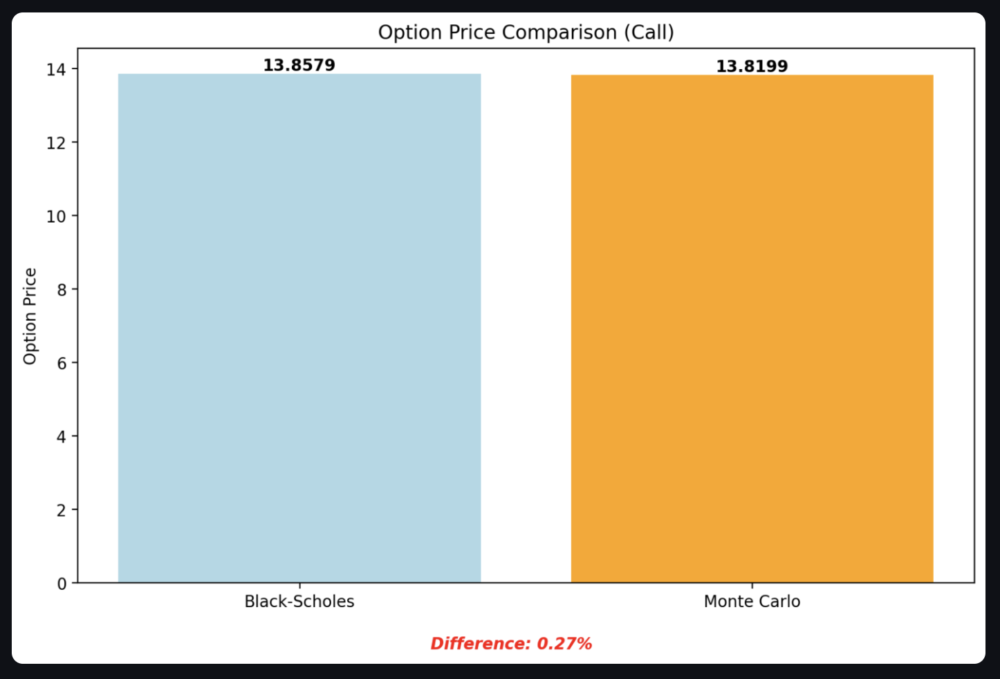

# Options Pricing and Greeks Analysis

## Contact info

Email: saimanishprabhakar2020@gmail.com

[Linkedin](https://www.linkedin.com/in/saimanish-prabhakar-3074351a0/)

## Project Overview

### Key Features

#### Customisable Option Parameters
Users can dynamically input and adjust: Option Type (Call/Put), Underlying Asset Price, Strike Price, Time to Expiration, Risk-Free Interest Rate, Volatility, Dividend Yield, and Monte Carlo Simulation Count

#### Visualisation and Analysis

1. **Options Pricing Insights**
   - Visual analysis of option prices
   - Sensitivity visualisations for: Volatility, Time to Expiration, Strike Price

2. **Monte Carlo Simulation**

   - **Visual Path Simulation**: 
     - Configurable display of 1-50 sample price paths (limited for visualisation purposes)
     - Interactive graph showing possible price evolution scenarios
   - **Pricing Calculation**:
     - Utilises 10,000 simulation paths by default for accurate price estimation
     - Configurable simulation count parameter for balancing precision and performance
   - **Price Distribution Analysis**:
     - Histogram showing distribution of final prices across all simulation paths
     - Statistical summary of simulation results

4. **Comprehensive Greeks Analysis**
   - First-Order Greeks: Delta, Gamma, Theta, Vega, Rho
   - Second-Order Greeks: Charm, Speed, Color, Zomma, Veta, Volga

#### Comparative Visualization
- Bar charts include a 'Difference %' metric
- Compares Black-Scholes and Monte Carlo method results
- Provides insight into model accuracy and deviation

#### Multi-Dimensional Sensitivity Plots

Based on Black-Scholes Greeks:
- Delta Surface: (Greek, Volatility, Stock Price)
- Gamma Surface: (Greek, Volatility, Stock Price)
- Vega Surface: (Greek, Volatility, Stock Price)
- Theta Surface: (Greek, Time to Expiration, Stock Price)
- Rho Surface: (Greek, Risk-Free Rate, Stock Price)

## Built with

- 

- 

- 

- 

- 

- 

## Getting Started

### 1. Clone the repository
```bash
git clone https://github.com/your_username/options-pricing-and-greeks.git
cd options-pricing-and-greeks
```
### 2. Create Virtual Environment (Optional but Recommended)
```bash
# Create virtual environment
python -m venv venv

# Activate virtual environment
# On Mac/Linux:
source venv/bin/activate
# On Windows:
venv\Scripts\activate

# Install required libraries
pip install -r requirements.txt

# When done working on the project
deactivate
```
### Alternative: Direct Installation
```bash
# If you prefer not to use a virtual environment, you can directly install dependencies
pip install -r requirements.txt
```
### 3. Change git remote url to avoid accidental pushes to base project
```bash
git remote set-url origin github_username/options-pricing-and-greeks
git remote -v # confirm the changes
```

## Usage

### Video walkthrough of project

Here is a video explaining everything about the concept of the project, its features, and how to get the most 
out of it. Alternatively, you can read the written step-by-step walkthrough of the project alongside some images 
below if you can't stand my voice!

*** Video Tutorial - Coming soon ***

### Step-by-Step image walkthrough of project

Adjust the default values of the parameters listed in the sidebar to your liking. 


If you're unsure about any parameter, hover over the question mark symbol for additional context.


As you adjust inputs, all visualisations update in real-time, comparing Black-Scholes and Monte Carlo pricing for both Call and Put options. The comparison graph shows pricing differences with a percentage deviation metric.



The next section demonstrates how options prices respond to changes in key factors:


The interactive Monte Carlo simulation graph allows you to visualize between 1-50 sample price paths using the slider and 'Generate New Paths' button. Note that this is for visualisation only and differs from the calculation model.


A histogram displays the distribution of option prices from 10,000 Monte Carlo simulations (default), along with key statistics.


Beyond pricing, the application analyses option Greeks (both first and second order) through tabular presentation:


These Greeks are also visualised graphically using the same comparative format as the pricing charts. Below are examples of first and second-order Greek analyses:


Finally, the application features interactive 3D sensitivity plots based on Black-Scholes Greeks. These plots show relationships between each Greek, relevant parameters (such as volatility, time-to-expiration, or risk-free rate), and stock price. 

We use "multi-dimensional sensitivity plots" terminology since different Greeks are primarily influenced by different parameters. A dropdown menu lets you explore various Greeks with full interactive controls for panning, zooming, and rotation.

For demonstration purposes, only the Delta sensitivity surface is displayed in this documentation.


## FAQ, Assumptions, and Limitations

This implementation represents one of several possible approaches to options pricing modeling, necessitating specific technical decisions and architectural trade-offs. 

For transparency and educational purposes, I have documented all underlying assumptions, computational limitations, and development challenges in the comprehensive [TECHNICAL_NOTES.md](TECHNICAL_NOTES.md) file
which also guides you on interpretation of certain plots such as the - 

- Multi-Dimensional Sensitivity Greeks Plots
- Monte Carlo Options Price Paths

## Future Improvements

- American Option Support: Implement early exercise capability using Least Squares Monte Carlo or binomial tree methods.
- Stochastic Volatility Models: Implement Heston, SABR, or local volatility models to better capture volatility smile/skew.

## Contributing

I hope you find some value from this project, and wish that it serves you well in your journey towards mastering options.

If you would like to contribute to the development of the options pricing and greeks analysis project, please:

1. Feel free to clone the repository to your local machine (follow the steps in the 'Getting Started' section)
2. Make your contribution, and then submit a pull request.
3. Use the discussions tab within the repository and raise issues if needed.
